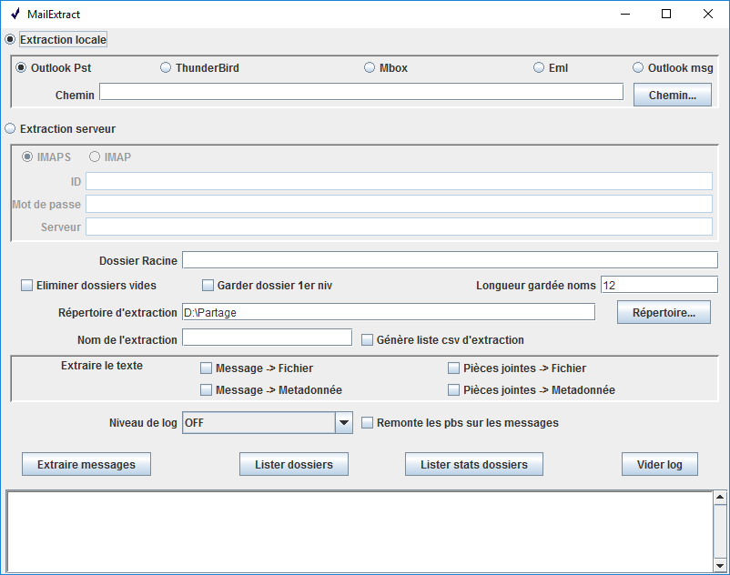

=======================
VITAM TOOLS-MAILEXTRACT
=======================

Ce projet propose une application permettant l'exportation de boites de messagerie locales ou distantes (class MailExtractApp) et l'ensemble de classes permettant l'implémentation de la fonction ailleurs (usage de la classe StoreExtractor).

Le code a été développé dans le cadre du programme Vitam, programme archivage numérique du gouvernement français (http://www.programmevitam.fr et https://github.com/ProgrammeVitam)

Il utilise :

* la bibliothèque JavaMail pour l'extraction de boites distantes (imap,imaps...) et dans les fichiers Thunderbird,

* la bibliothèque java-libpst pour l'extraction de boites dans les fichiers Outlook (merci à Richard Johnson http://github.com/rjohnsondev),

* la bibliothèque POI HSMF library pour l'extraction des messages .msg de Microsoft.

Note: Pour l'instant il ne permet pas d'extraire de messages S/MIME (chiffrés ou signés).

C'est un projet maven standard (archétype quickstart) avec une documentation javadoc complète (dans le répertoire /doc).  

*Vous pouvez voir ci-dessous le manuel de l'application (et voir les fonctions accessibles par StoreExtractor)*

**ATTENTION**: Cette application a été développée pour étudier la technique d'extraction des messageries et l'organisation du résultat sous forme d'archive, au titre de preuve de concept.
Elle n'a pas été développée selon les règles standard de développement du programme VITAM (en particulier il n'y a pas de test unitaire).
**ELLE NE DOIT PAS ETRE UTILISEE EN PRODUCTION EN L'ETAT**

Lancement
---------

Dans tous les cas s'il n'y a pas une option -x, -l ou -z (extraction, list, stats), l'interface graphique est ouverte.

* Linux or windows

1. java -Dfile.encoding="UTF-8" -jar MailExtract.jar arguments...

*Les utilitaires doivent toujours être lancés en mode UTF-8 pour assurer la cohérence des fichiers exportés et importés entre utilitaires*  

* Windows

1. Ouvrez l'application console "cmd"
2. Utilisez l'application "MailExtract.exe", créée avec launch4j, en entrant la commande "install_dir\MailExtract arguments..." (cf ci-dessous pour la description des arguments)

Exemple : *c:\\Users\\XXX\\Desktop\\MailExtract -m imap -u "toto@titi.fr" -p "AZERTY" -s imap.titi.fr -r "c:\\Users\\XXX\\Documents" -d -a -f "INBOX\\Sent -x"*

Cette commande permet, si le fichier mailextract est sur le bureau de l'utilisateur XXX, d'extraire les messages du répertoire INBOX\\Sent de la boite imap "toto@titi.fr" avec le mot de passe "AZERTY" et d'en mettre le résultat dans un répertoire appelé toto@titi.fr-[timestamp] dans "Mes Documents", sans prendre les répertoires vides.  

Pensez à mettre des "" autour des champs qui contiennent des caractères non-alphanumériques et qui pourraient être interprétés avant l'exécution de la commande. A noter aussi le séparateur de nom de répertoires à utiliser est celui natif du système d'exécution "\\" sous windows et "/" sous Linux.

On peut aussi l'ouvrir en lançant simplement par clic sur "MailExtract.exe". Dans ce cas, ou s'il n'y a pas un argument d'action, c'est l'interface graphique qui est lancée.

Les deux fichiers MailExtract.jar et MailExtract.exe sont disponibles sur Bintray [https://bintray.com/programmevitam/vitam-mailextract-dist].

Manuel MailExtract
------------------

Il réalise l'extraction ou l'édition de la structure de boites de messageries de différentes sources:

* serveur *IMAP* or *IMAPS* avec identifiant/mot de passe
* *répertoire Thunderbird* contenant des fichiers mbox et des hiérarchies en .sbd
* fichier *Outlook pst*

L'extraction génère une structure de répertoire et fichiers (format "sur disque") représentant une structure d'Archive Unit au sens du SEDA (NF Z44-022). Pour plus d'information voir le javadoc de la classe StoreExtractor.
L'opération, d'extraction ou d'édition, peut être loggée sur la console et dans un fichier (root/username[-timestamp].log - cf args).
Selon le niveau choisi de log vous aurez: erreur fatale d'extraction (SEVERE), avertissement sur les problèmes d'extraction et les items abandonnés (WARNING), informations sur le process global (INFO), liste des répertoires traités (FINE), liste des messages traités (FINER), problèmes avec certaines méta-données (FINEST).
Le niveau par défaut de log est INFO pour l'extraction et OFF pour l'édition de structure.

La syntaxe des arguments est:

--help                        aide
--type                        type de conteneur local à extraire (thunderbird|pst|eml|mbox) ou protocole d'accès distant (imap|imaps|pop3...)
--user                        nom d'utilisateur de la boite (aussi utilisé pour générer le nom de l'extraction)
--password                    mot de passe
--server                      serveur de messagerie [HostName|IP](:port)
--container                   localisation sur le disque du conteneur local à utiliser (répertoire Thunderbird, fichier pst, eml, mbox, msg...)
--folder                      répertoire particulier de la boite à partir duquel faire l'extraction ou l'édition de la structure
--rootdir                     répertoire de base sur le disque (par défaut répertoire courant de la console) pour l'extraction (extraction en root/username[-timestamp])
--addtimestamp                ajoute un indicateur de temps au nom du répertoire d'extraction sur le disque (root/username-timestamp)
--keeponlydeep                garde les répertoires vides sauf ceux à la racine (il existe couramment des répertoires non utilisés à côté de INBOX)
--dropemptyfolders            n'extrait pas les répertoires n'ayant aucun message en direct ou dans on arborescence
--loglevel                    niveau de log (SEVERE| WARNING| INFO| FINE| FINER| FINEST)
--nameslength	              longueur limite des noms de répertoires et fichiers générés
--extractlist                 génère une liste csv de tous les messages extraits avec une sélection des métadonnées, dont les détails de rendez-vous
--extractmessagetextfile      extrait un fichier avec le texte du message
--extractmessagetextmetadata  inclus le texte du message dans les métadonnées
--extractfiletextfile         extrait un fichier avec le texte des fichiers attachés
--extractfiletextmetadata     inclus le texte du fichier attaché dans les métadonnées
--warning                     génère un avertissement quand il y a un problème d'extraction limité à un message en particulier (sinon cela est loggé au niveau FINE)
-x                            fait l'extraction
-l                            édite l'ensemble des répertoires de la messagerie (ne prend pas en compte les options -d et -k)
-z                            édite l'ensemble des répertoires de la messagerie ainsi que le nombre et le poids des messages qu'ils contiennent (ne prend pas en compte les options -d et -k)

A noter: Si aucune option -x, -l ou -z n'est mise l'interface graphique est lancée avec les éléments complétés.

Les libellés long des options peut être réduit au premier caractère précédé d'un seul - (par exemple -h est équivalent à --help)

**AVERTISSEMENT**: Editer la liste des répertoires avec le nombre et poids des messages est une opération potentiellement lourde sur un serveur distant car cela nécessite d'importer l'ensemble des messages.

Interface MailExtract
---------------------

Toutes les options de ligne de commande se retrouvent aussi sur l'interface graphique.

