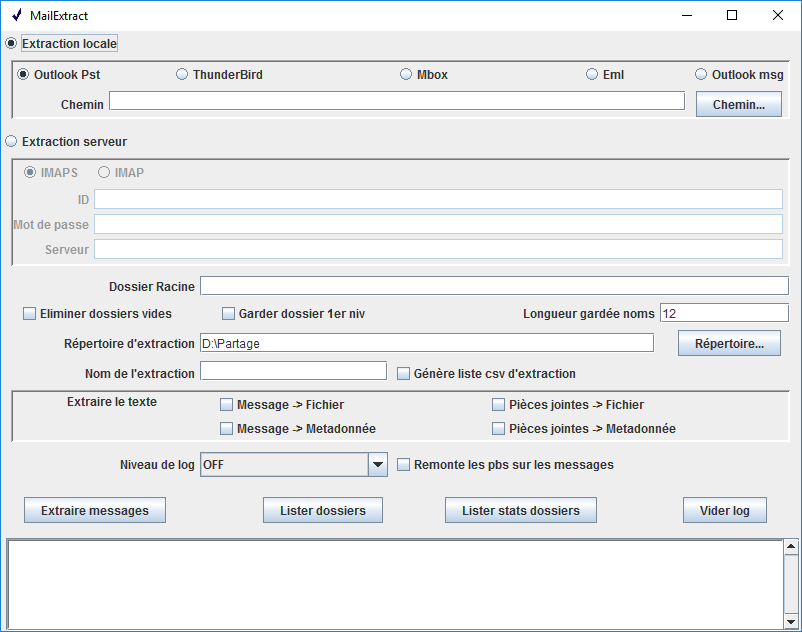

VITAM TOOLS-MAILEXTRACT
=======================

This project implement a local or distant mail box extraction application (class MailExtractApp) and the really operational class (class StoreExtractor) that can be used elsewhere.

This code has been developed for the "Programme Vitam", French government Digital Archives Management System project (http://www.programmevitam.fr et https://github.com/ProgrammeVitam).

It uses :

* the JavaMail library for distant imap(s) and local Thunderbird extraction, 

* the java-libpst for local Outlook extraction (thanks to  to Richard Johnson http://github.com/rjohnsondev).

* the POI HSMF library for .msg Microsoft message extraction

Note: For now it can't extract S/MIME (ciphered and/or signed) messages.

It's a standard maven project (quickstart archetype) with full javadoc (in /doc)

*You can see under the manual for the application (and see what the StoreExtractor class can do...)*

**BEWARE**: This application has been developed to study the extraction technology and the result archives organisation, as a proof of concept.
It doesn't respect the design and coding rules of VITAM program (
Elle n'a pas été développée selon les règles standard de développement du programme VITAM (especially there is no unitary test).
**IT SHOULD NOT BE USED IN REAL PRODUCTION AS IS**

Launching
---------

In all cases if there is no option -x, -l or -z (extraction, list, stats), the graphic interface is opened.

* Linux or windows

1. java -Dfile.encoding="UTF-8" -jar mailextract.jar arguments...

*The tools have always to be launch in UTF-8 mode to maintain consistency of exports and imports*

* Windows

1. Open console application "cmd"
2. Use application "MailExtract.exe", created with launch4j, typing "install_dir\MailExtract arguments..." (cf below for the arguments description)

By exemple : *c:\\Users\\XXX\\Desktop\\mailextract -m imap -u "toto@titi.fr" -p "AZERTY" -s imap.titi.fr -r "c:\\Users\\XXX\\Documents" -d -a -f "INBOX\\Sent -x"*

This command, if the MailExtract file is on the desktop of user XXX, extract messages from the INBOX\\Sent folder in the imap mailbox "toto@titi.fr" with "AZERTY" password and write the extraction result in a disk folder named toto@titi.fr-[timestamp] in "My Documents", discarding empty mailbox folders.  

Do not forget to put "" around fields containing not alphanumeric characters that could be interpreted before command execution. Note that the directory name separator to use is the native of the used system "\\" on windows and "/" on Linux.

It can also be opened by simply clicking on "MailExtract.exe". In this case, or if there is not an action argument, the GUI is launched.

Both files mailextract.jar and mailextract.exe are available on Bintray [https://bintray.com/programmevitam/vitam-mailextract-dist].

MailExtract manual
------------------

It performs extraction and structure listing of mail boxes from different sources:

  * *IMAP* or *IMAPS* server with user/password login
  * *Thunderbird directory* containing mbox files and .sbd directory hierarchy
  * *Outlook pst* file

The extraction generate on disk a directories/files structure convenient for SEDA archive packet (NF Z44-022). For detailed information see class StoreExtractor.

The operation, extraction or listing, can be logged on console and file (root/username[-timestamp].log - cf args). At the different levels you can have: extraction errors (SEVERE), warning about extraction problems and items dropped (WARNING), information about global process (INFO), list of treated folders (FINE), list of treated messages (FINER), problems with some expected metadata (FINEST).
The default level of log is INFO for extracting and OFF for listing.

The arguments syntax is:

--help                        help
--type	                      type of local container to extract (thunderbird|pst|eml|mbox) or protocol for server access (imap|imaps|pop3...)
--user                        user account name (also used for destination extraction naming)
--password                    password
--server                      mail server [HostName|IP](:port)
--container                   mail container directory for mbox or file for pst, mbox, eml, msg...
--folder                      specific mail folder used as root for extraction or listing
--rootdir                     root (default current directory) for output to root/username directory
--addtimestamp                add a timestamp to output directory (root/username-timestamp)
--keeponlydeep                keep only empty folders not at root level
--dropemptyfolders            drop empty folders
--loglevel                    event level to log (SEVERE| WARNING| INFO| FINE| FINER| FINEST)
--nameslength	              length limit for directories and files generated names
--extractlist                 generate a csv list of all extracts with a selection of metadata, including appointments details
--extractmessagetextfile      extract a text file version of messages
--extractmessagetextmetadata  put message text in metadata
--extractfiletextfile         extract a text file version of attachment files
--extractfiletextmetadata     put file text in metadata
--warning                     generate warning when there's a problem on a message (otherwise log at FINEST level)
-x		              extract
-l                            access account and list folders (no drop options)
-z                            access account and list folders and there statistics (no drop options)

To be noted: When no -x, -l or -z option is set, the graphic interface is opened, using defined parameters.

Long options can be reduced to short ones (for example -h is equivalent to --help)

**Warning**: Listing with detailed information is a potentially expensive operation, especially when accessing distant account, as all messages are inspected (in the case of a distant account that mean also downloaded...).

MailExtract GUI
---------------

All command options are on the GUI.

